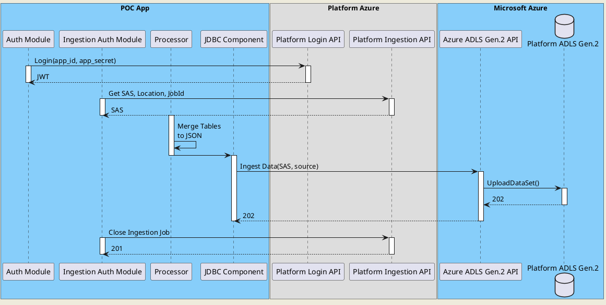

# Overview 
A POC application, using Apache Camel as an alternative to ADF for extracting data from a relational database, transforming to JSON, uploading to ADLS, and triggering platform ingress.

# For VSCode Users
Ensure 'Lombok Annotations Support for VS Code' is installed

# Building and Running

``` bash
$ ./mvnw clean package
$ java -jar target/camel-etl-0.0.1-SNAPSHOT.jar
$
$ ./mvnw package -DskipTests && java -jar target/camel-etl-0.0.1-SNAPSHOT.jar  // build and run immediately without tests
```

``` powershell
$ ./mvnw clean package
$ java -jar target/camel-etl-0.0.1-SNAPSHOT.jar
$
$ ./mvnw package -DskipTests; java -jar target/camel-etl-0.0.1-SNAPSHOT.jar  // build and run immediately without tests
$ ./mvnw package -DskipTests; java -javaagent:target/docker/build/maven/agent/jmx_prometheus_javaagent-0.14.0.jar=9779:target/classes/config.yaml -jar target/camel-etl-0.0.1-SNAPSHOT.jar


```

# Use Cases
Data Ingestion flows will cover the following use cases (all use cases will be using Platform Ingestion APIs for authentication purposes): 

Use Cases:

| # | Source     | Sink      | Data Transformation               | More Details|
|---|------------|-----------|-----------------------------------|-------------|
| 1 | SQL Server | ADLS Gen2 | Relational Tables to Nested JSON  | Ingress     |

</br>
The following sequence diagram describes the first simple use case.
</br>

PlantUML Online Viewer: https://plantuml-editor.kkeisuke.com/


#1



## Non Functional Requirements

+ Logging, Monitoring, Alerting
+ Process Status (Real Time)
+ Jobs Scheduling
+ Configurability
  + Dynamic Data Source
  + Dynamic Data Sink
  + Parameters / Variables
+ Plugins
+ Pause / Restart Job
+ Failure Tolerance
  + Restart Jobs
  + Rollback
  + Compensation Transaction
  + Bad Transaction Management Configuration
+ Scalability
  + Run Parallel Ingestion Job 
    + Same server
    + Different servers
    + Correlation
    + Eventual Data Consistency
+ In Memory Processing (configurable batch sharding)
+ Mount Secrets Volumes to Store Secrets for Routes
  + Local HSM
  + AWS Key Management service
  + K8S Secrets / ConfigMaps / PV
  + Azure KV

## Functional Requirements

+ Data Sources
  + SQL
  + Oracle
  + S/FTP

+ Hosting
  + AKS / EKS
  + App Service / Elastic Beanstalk
